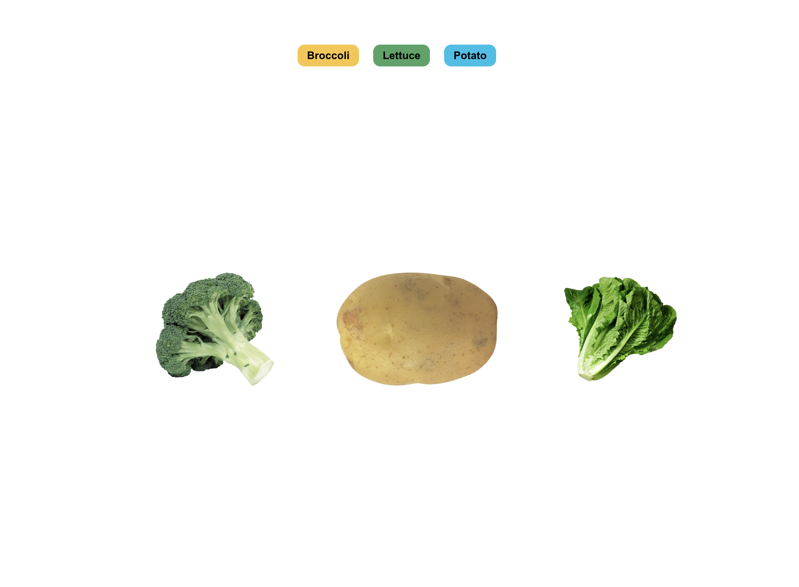

# Word Association Game

A simple Word Association Game built with React and CSS.



## How to play

1. Choose one of the words that appear at the top of the page.
2. Drag it to match the correct image.
3. When you release the word, you will hear how it is pronounced.
4. If the association is correct, a green check mark will appear below the image.
5. If the association is incorrect, you can try again.
6. The most important step: have fun!

## For Developers

### Built with

This project uses React and Pure CSS. The interaction is built using the [HTML Drag&Drop API](https://developer.mozilla.org/en-US/docs/Web/API/HTML_Drag_and_Drop_API/File_drag_and_drop) and [Web Speech API](https://developer.mozilla.org/en-US/docs/Web/API/SpeechSynthesisUtterance).

### Getting Started

1. Clone the repo.
2. Install the dependencies.

```
npm install
```

3. Run the project.

```
npm start
```

### Current Implementation

The current implementation covers a basic use case. However, the isual components are built as dummies separated from the business logic to allow the scalability, reusability and also reduce the maintainance time.

I decided to use React, HTML APIs and pure CSS to keep the simplicity of all the elements, especially since I've used the HTML Drag&Drop API before. The state of the application -which in this case is minimal- is handled by the view itself.

### Accesibility

The current application barely covers all accessibility needs. This solution includes:

- Tags are identified and roles are included using semantic HTML.

Some of the possible improvements

- Handling interaction using the keyboard. This [article](https://medium.com/salesforce-ux/4-major-patterns-for-accessible-drag-and-drop-1d43f64ebf09) provides an interesting walkthrough on different approaches to implement accessible drag-and-drop functionality.
